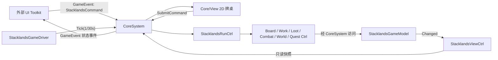
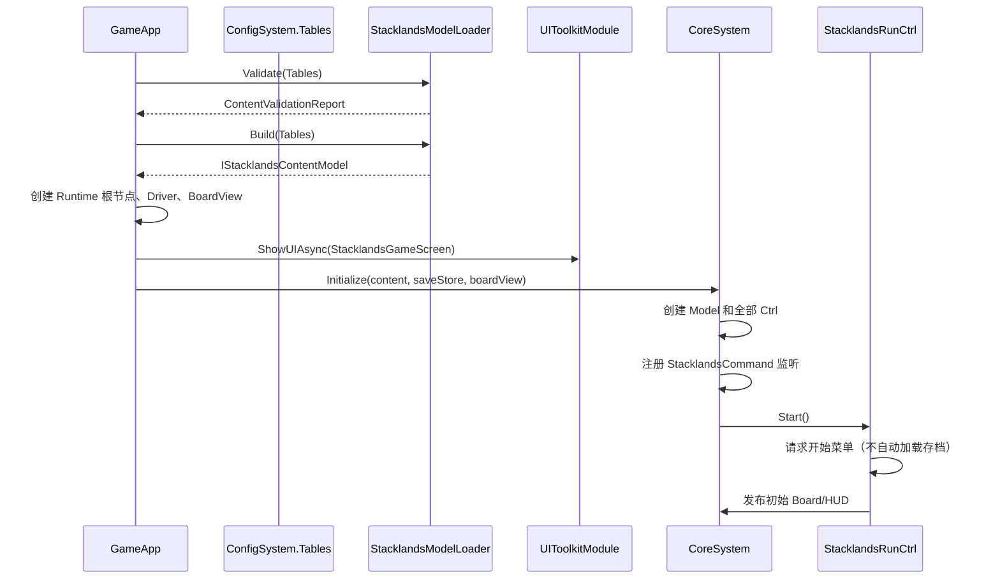
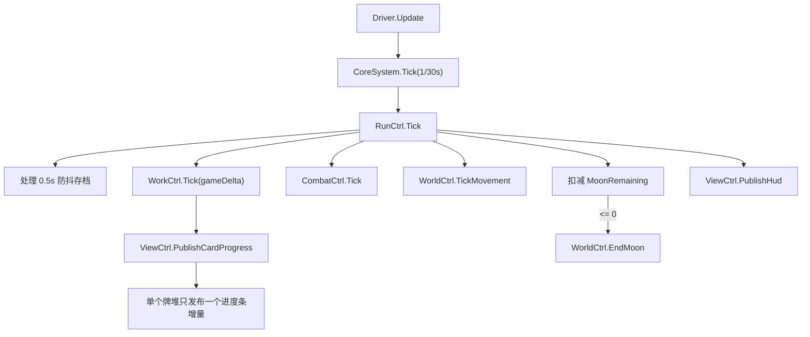
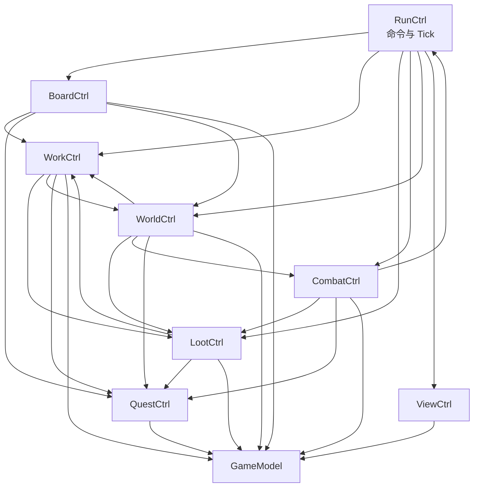
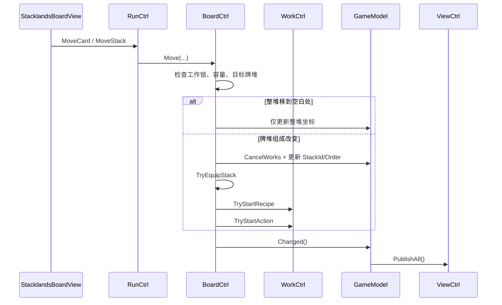

# Stacklands Core 代码结构与调用关系

本文档说明当前 `UnityProject/Assets/GameScripts/HotFix/GameLogic/Core/` 的实际代码结构、调用入口和模块关系。内容以当前源码为准，用于后续扩展玩法、排查调用链和保持 Core 边界一致。

相关规则文档：

- [Stacklands Original 玩法与操作逻辑总结](./Stacklands-Original玩法与操作逻辑总结.md)
- [Stacklands Original 卡牌配方与玩法逻辑](./Stacklands-Original卡牌配方与玩法逻辑.md)

## 1. Core 边界

`Core/` 是 Stacklands 专属玩法的唯一实现位置，包括运行时状态、规则、控制器、内容目录和 2D 牌桌表现。外部 UI、框架模块和平台集成不得直接持有 `StacklandsGameModel` 或任一 Ctrl。

当前采用由 `CoreSystem` 协调的 MVE 变体：



约束要点：

- `CoreSystem` 持有唯一的 Model、Ctrl 和 2D View 引用。
- Ctrl 不互相保存引用；需要协作时通过 `CoreSystem.XxxCtrl` 调用。
- Ctrl 通过 `CoreSystem.Model` 获取可变运行时状态。
- 外部 UI 只发送 `StacklandsCommandDto`，只接收快照和流程事件。
- Luban 生成类型只在 `StacklandsModelLoader` 转换阶段出现，不进入其他玩法 Ctrl。
- 随机玩法统一使用 `DeterministicRandom`，随机状态写入 Run 存档。

## 2. 目录结构

```text
Core/
├── CoreSystem.cs                 # Core 唯一协调器和公共生命周期入口
├── StacklandsContracts.cs        # 命令、流程和只读表现快照 DTO
├── StacklandsGameDriver.cs       # Unity 帧到 1/30 秒固定步长的适配器
├── StacklandsSaveStore.cs        # 存档接口和 JSON 实现
├── DeterministicRandom.cs        # 可存档、可重放的确定性随机数
├── Ctrl/
│   ├── StacklandsRunCtrl.cs      # 当前局生命周期、命令路由、Tick、存档
│   ├── StacklandsBoardCtrl.cs    # 卡牌移动、堆叠、出售、装备和卸装
│   ├── StacklandsWorkCtrl.cs     # 配方、动作、计时、消耗、产出、里程碑
│   ├── StacklandsLootCtrl.cs     # 掉落池、购买/打开/移动卡包、保底和闪卡
│   ├── StacklandsCombatCtrl.cs   # 自动战斗、装备修正、效果、死亡和胜负
│   ├── StacklandsWorldCtrl.cs    # Moon、喂食、上限、追击、传送门和商车
│   ├── StacklandsQuestCtrl.cs    # 任务条件计算、跨局完成状态和解锁
│   └── StacklandsViewCtrl.cs     # Model 到不可变表现快照的转换
├── Model/
│   ├── IStacklandsContentModel.cs # 内容目录公共只读接口
│   ├── StacklandsContentModel.cs  # 内容索引和配方反向索引实现
│   ├── StacklandsModelLoader.cs   # Luban 转换、引用和规则校验
│   ├── ContentModel.cs            # 卡牌、配方、掉落、卡包和世界规则定义
│   ├── GameplayModel.cs           # 单位、装备、建筑、动作、效果和任务定义
│   ├── StacklandsRuntimeModel.cs  # Profile、Run、卡牌、卡包和工作存档数据
│   ├── StacklandsGameModel.cs     # 当前局可变状态容器和基础查询/变更方法
│   └── ContentValidationReport.cs # 内容结构校验报告和缺失数据异常
└── View/
    ├── StacklandsBoardView.cs     # 2D 牌桌创建、输入、相机和快照渲染
    ├── CardView.cs                # 卡牌图形、文字、描边、进度和层级
    ├── BoosterView.cs             # 已购买卡包的显示、点击和拖动表现
    ├── ShopSlotView.cs            # 顶部卡包购买槽
    └── SellSlotView.cs            # 出售投放槽和金币显示
```

## 3. 启动与释放入口

游戏启动入口不在 `Core/` 内，而在 [`GameApp.cs`](../UnityProject/Assets/GameScripts/HotFix/GameLogic/GameApp.cs)：



主要公共入口：

| API | 调用者 | 作用 |
|---|---|---|
| `CoreSystem.Initialize(...)` | `GameApp.StartGameLogic` | 创建 Model/Ctrl、注册命令、请求开始菜单 |
| `CoreSystem.SubmitCommand(dto)` | `Core/View`，测试或内部适配器 | 直接把命令交给 `RunCtrl.Handle` |
| `EventDefine.StacklandsCommand` | 外部 UI/集成层 | 跨 Core 边界发送同一类命令 |
| `CoreSystem.Tick(delta)` | `StacklandsGameDriver` | 推进固定步长模拟 |
| `CoreSystem.Save()` | Driver 的后台/退出回调 | 立即保存当前 Profile 和 Run |
| `CoreSystem.Release()` | `GameApp.Release` | 注销事件、保存并释放所有引用 |

释放时注册和注销严格对称。`CoreSystem.Release()` 会先保存，再将 View、Ctrl 和 Model 引用置空。

## 4. 命令入口与路由

外部 UI 使用以下方式进入 Core：

```csharp
GameEvent.Send(
    EventDefine.StacklandsCommand,
    new StacklandsCommandDto
    {
        Kind = StacklandsCommandKind.SetSpeed,
        Number = 5f,
    });
```

`Core/View/StacklandsBoardView` 位于 Core 边界内部，因此直接调用：

```csharp
CoreSystem.SubmitCommand(new StacklandsCommandDto
{
    Kind = StacklandsCommandKind.MoveCard,
    InstanceId = cardInstanceId,
    TargetInstanceId = targetInstanceId,
    X = boardX,
    Y = boardY,
});
```

所有命令最终进入 `StacklandsRunCtrl.Handle`：

| 命令 | 参数 | 实际接收者 |
|---|---|---|
| `NewGame` | `Flag=peaceful`, `Number=moonLengthIndex` | `RunCtrl.NewGame` |
| `ContinueGame` | 无 | `RunCtrl.LoadRun` |
| `SetSpeed` | `Number=0/1/5` | `RunCtrl` 直接修改 Run |
| `MoveCard` | 实例、目标、坐标 | `BoardCtrl.Move(..., false)` |
| `MoveStack` | 实例、目标、坐标 | `BoardCtrl.Move(..., true)` |
| `SelectCard` | 卡牌实例 | Model 记录选中项，`ViewCtrl.PublishBoard` |
| `BuyBooster` | `ContentId=packId` | `LootCtrl.BuyBooster` |
| `OpenBooster` | 卡包实例 | `LootCtrl.OpenBooster` |
| `MoveBooster` | 卡包实例、坐标 | `LootCtrl.MoveBooster` |
| `SellCard` | 卡牌实例 | `BoardCtrl.Sell` |
| `Equip` | 装备实例、单位实例 | `BoardCtrl.Equip` |
| `Unequip` | 单位实例 | `BoardCtrl.Unequip` |
| `ConfirmSummon` | `Flag=true`、来源实例 | `WorkCtrl.StartSummonAction` |
| `SaveGame` | 无 | `RunCtrl.SaveNow` |

`StacklandsBoardView` 的拖放通常发送 `MoveCard`/`MoveStack`，装备不是由 View 特判：牌堆改变后，`BoardCtrl` 自动依次尝试装备、配方和卡牌动作。

## 5. 固定步长调用链

`StacklandsGameDriver.Update()` 累积 `Time.unscaledDeltaTime`，以 `1/30` 秒固定步长调用 Core。暂停和倍速由 `Run.Speed` 作用于玩法 delta，不影响 Unity 自身时间。



当速度为 `0` 或等待处理卡牌上限时，玩法系统停止推进。存档倒计时和 Unity 输入仍使用未缩放时间；速度命令会立即发布一次 HUD 快照。

## 6. Model 分层与状态所有权

### 6.1 内容模型

`StacklandsModelLoader` 是 Luban 与玩法 Core 之间的唯一转换器：

1. 从 `GameConfig.Tables` 读取生成表。
2. 转换为 `CardDefinition`、`RecipeDefinition` 等纯 C# 只读定义。
3. 建立稳定字符串 ID 索引、配方产出索引和蓝图索引。
4. 校验卡牌/池/卡包/任务引用、卡槽数、掉落池后备循环、配方冲突、动作里程碑和世界规则。
5. 返回 `IStacklandsContentModel`。

玩法 Ctrl 只能依赖 `IStacklandsContentModel`，不要直接访问 `GameConfig.stacklands.*`。

### 6.2 运行时模型

| 状态 | 生命周期 | 主要内容 |
|---|---|---|
| `StacklandsProfileData` | 跨局 | 已发现卡牌、已完成任务、一次性奖励、购包计数、设置 |
| `StacklandsRunData` | 当前局 | Moon、速度、模式、RNG、卡牌、卡包、工作、计数器 |
| `CardRunData` | 卡牌实例 | 内容 ID、牌堆、顺序、坐标、HP、装备、冷却和状态 |
| `BoosterRunData` | 卡包实例 | 卡包 ID、坐标、预抽结果、闪卡标记和已翻数量 |
| `WorkRunData` | 工作实例 | 配方/动作 ID、牌堆、参与卡、总时长和剩余时间 |

`StacklandsGameModel` 负责状态容器和基础原子操作，例如 `AddCard`、`RemoveCard`、食物统计、牌堆查询、计数器和存档清理；具体规则判断仍由 Ctrl 完成。

状态修改后的常用途径：

```text
Ctrl 修改 Model
  → Model.Changed()
  → Run.Revision++
  → MarkDirty()，启动 0.5 秒防抖保存
  → CoreSystem.ViewCtrl.PublishAll()
  → BoardSnapshot + HudSnapshot
```

工作计时不每帧调用 `Changed()`，而是通过 `PublishCardProgress()` 发送轻量增量，避免每个固定步长复制完整牌桌。

## 7. Ctrl 职责和互相调用关系



### `StacklandsRunCtrl`

- 是所有命令的统一路由器。
- 创建新局、加载旧局、控制速度和固定步长顺序。
- 协调工作、战斗、世界移动、Moon 和 HUD。
- 执行 Profile/Run 保存以及存档错误流程。

### `StacklandsBoardCtrl`

- 处理单卡/整堆移动、合并、拆堆、容量限制和工作中牌堆锁定。
- 整堆只做空间平移时保留 `StackId` 和工作剩余时间。
- 牌堆组成改变时取消受影响工作，然后依次尝试装备、配方、动作。
- 出售卡牌并生成 `gold` 卡。
- 装备写入单位的 `EquipmentCardId`；替换装备时旧装备回到牌桌。

### `StacklandsWorkCtrl`

- 按优先级匹配配方的数量、卡牌 ID/标签、额外卡和消耗方式。
- 匹配来源卡动作、工人要求、计时和工作速度。
- 完成时消费/保留输入，生成结果，处理掉落池、里程碑和重复动作。
- Summon 动作先发布确认流程，确认后才真正启动。

### `StacklandsLootCtrl`

- 处理带条件、权重、后备池、无放回和一次性范围的掉落池。
- 购买时扣除价格卡、执行村民保底并预抽整个卡包。
- 点击卡包时逐张产出预抽结果；翻完后销毁卡包并更新任务。
- 拖动卡包只更新坐标，不改变 `Revealed` 和预抽结果。

### `StacklandsCombatCtrl`

- 对同一牌堆内敌我单位执行自动攻击。
- 计算攻击间隔、命中、伤害、防御、装备修正、克制、暴击和效果。
- 死亡时生成尸体/指定结果和 Defeat 掉落。
- Demon 死亡触发胜利；曾有村民但已无 Villager 类别卡时触发失败。

### `StacklandsWorldCtrl`

- 驱动敌人追击并按 0.1 秒节流发布位置快照。
- 月末按优先级喂食，食物不足时调用 `CombatCtrl.Kill`。
- 检查卡牌上限、开始下一 Moon、生成传送门和商车。
- 根据 Moon 和世界规则构造传送门威胁预算。

### `StacklandsQuestCtrl`

- 根据 Run 计数器、Profile、持有卡牌、Moon 和解锁状态计算任务条件。
- 完成状态写入 Profile，并通过 Notification 事件通知 UI。
- 卡包解锁由已完成任务数量和卡包配置共同决定。

### `StacklandsViewCtrl`

- 是 Model 到表现层的唯一转换器。
- 生成 `BoardSnapshot`、`HudSnapshot` 和 `CardProgressBatch`。
- 把装备后的单位映射为职业显示卡，但不把生成配置类型暴露给 View/UI。
- 每个工作只选择牌堆最高 `StackOrder` 的卡牌显示一条进度条。

## 8. 关键玩法调用链

### 8.1 卡牌拖放、装备和合成



当前规则中，正在合成/工作的目标牌堆不能叠加新卡；拒绝时重新发布 Board 快照，使拖动表现回到原坐标。

### 8.2 工作完成

```text
RunCtrl.Tick
  → WorkCtrl.Tick
  → Remaining -= gameDelta
  → 到时后移除 WorkRunData
  → CompleteRecipe 或 CompleteAction
  → 消耗输入 / RollPool / 生成卡牌 / 应用里程碑
  → QuestCtrl.Evaluate
  → Model.Changed
```

### 8.3 卡包购买、拖动与翻牌

```text
点击顶部 ShopSlot
  → BuyBooster
  → 校验解锁和金币
  → 预抽所有卡槽结果并保存到 BoosterRunData
  → 在牌桌生成 BoosterView

按下并松开卡包（移动不足 10px）
  → OpenBooster
  → Revealed++
  → 按预抽结果生成一张卡

拖动卡包（移动达到 10px）
  → MoveBooster
  → 只保存 X/Y，不翻牌
```

### 8.4 月末结算

```text
MoonRemaining <= 0
  → WorldCtrl.EndMoon
  → 汇总单位与食物
  → 按 Baby、Dog、其他单位顺序喂食
  → 食物不足的单位进入 Kill 流程
  → 消耗食物卡
  → 检查卡牌上限
  → 超限：暂停并请求 CardLimit 流程
  → 未超限：BeginNextMoon + 随机事件
  → 立即保存并发布状态
```

## 9. 表现层和事件出口

`CoreSystem` 同时把快照直接交给 Core 内的 2D View，并通过 `GameEvent` 发给外部 UI：

| 事件 | 数据 | 当前用途 |
|---|---|---|
| `StacklandsBoardChanged` | `BoardSnapshot` | 卡牌/卡包增删、位置、选中详情 |
| `StacklandsCardProgressChanged` | `CardProgressBatch` | 合成/工作实时进度增量 |
| `StacklandsHudChanged` | `HudSnapshot` | Moon、时间、食物、上限、任务、商店 |
| `StacklandsFlowRequested` | `FlowRequest` | 主菜单、超限、召唤确认、胜利、失败、存档错误 |
| `StacklandsNotification` | `string` | 任务完成、购买失败等短提示 |

当前界面拆分为开始界面与游戏界面：[`StacklandsStartScreenController.cs`](../UnityProject/Assets/GameScripts/HotFix/GameLogic/UIToolkit/StacklandsStartScreenController.cs) 负责开始菜单与新回合设置弹窗，只监听 Flow；[`StacklandsGameScreenController.cs`](../UnityProject/Assets/GameScripts/HotFix/GameLogic/UIToolkit/StacklandsGameScreenController.cs) 负责 HUD、任务、卡牌详情与其余流程弹窗，监听 Board、HUD、Flow 和 Notification。`GameApp` 启动时打开开始界面，继续回合/开始新回合后切换到游戏界面，主菜单流程再切回。进度增量由 `CoreSystem` 直接调用 `StacklandsBoardView.RenderCardProgress`；事件也已发布，供其他表现层按需订阅。

`StacklandsBoardView` 负责：

- 创建正交相机、牌桌、装饰、出售槽和购买槽。
- 生成并维护 `CardView`、`BoosterView` 实例字典。
- 鼠标/触屏拖放、整堆长按、平移、缩放和点击开包。
- 使用临时高 `SortingGroup` 层级显示正在拖动的单卡、整堆或卡包。
- 只发送命令，不自行修改 Run 状态。

## 10. 存档调用关系

`JsonStacklandsSaveStore` 实现 `IStacklandsSaveStore`：

- `Profile` 和 `Run` 分文件保存为 JSON。
- 先写 `.tmp`，旧文件复制为 `.bak`，再替换正式文件。
- 主文件读取失败时尝试 `.bak`。
- `Model.Changed()` 启动 0.5 秒防抖保存。
- 月末、胜负、应用进入后台、退出和 `CoreSystem.Release()` 会立即保存。
- 保存前把 `DeterministicRandom.State` 写回 `Run.RandomState`，继续游戏后随机序列可延续。

默认存档目录由 `GameApp` 传入：

```text
Application.persistentDataPath/StacklandsOriginal/
├── stacklands-original-profile.json
└── stacklands-original-run.json
```

每个正式文件还可能有对应的 `.bak`。

## 11. 扩展代码时的约定

新增功能时按以下归属处理：

- 新玩法状态：加入 `StacklandsRuntimeModel`，并确认 JSON 兼容性。
- 新配置定义：加入 Model 定义和 `IStacklandsContentModel`，只在 Loader 接触 Luban 类型。
- 新玩家操作：在 Contracts 增加命令，由 `RunCtrl.Handle` 路由到对应 Ctrl。
- 新持续规则：由 `RunCtrl.Tick` 按确定顺序调用相应 Ctrl。
- 新表现状态：由 `ViewCtrl` 转换为只读快照，再经 `CoreSystem` 发布。
- 新 UI 操作：外部 UI 通过 `EventDefine.StacklandsCommand` 发送，不能直接引用 Ctrl/Model。
- 新 Ctrl 协作：通过 `CoreSystem` 转发，不在 Ctrl 字段中缓存另一个 Ctrl。
- 任何可重放随机结果：只能使用 `Model.Random`，不能使用 `UnityEngine.Random`。
- 修改卡牌数值、配方、掉落或世界规则：优先改 Luban Excel 并重新生成，禁止手改生成代码和 `.bytes`。

建议同步增加 `UnityProject/Assets/Tests/EditMode/` 下的测试，至少覆盖命令输入、状态变化、快照结果和存档往返。
