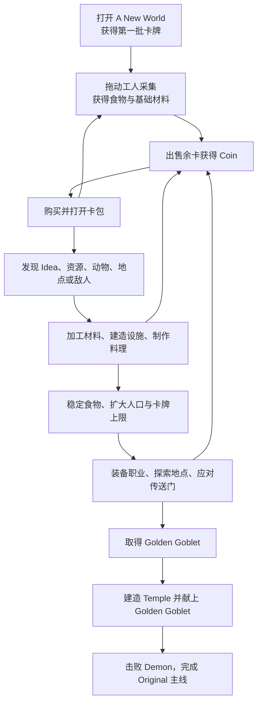
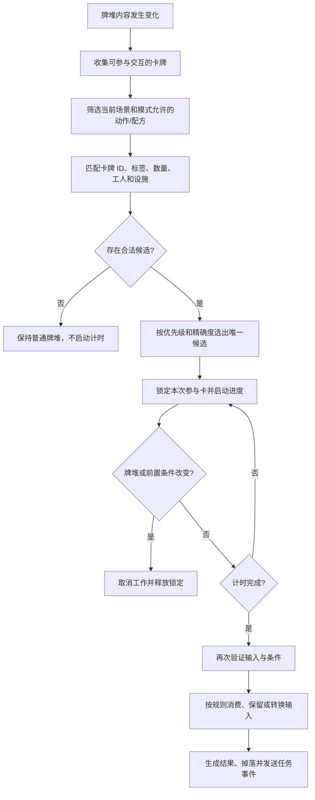
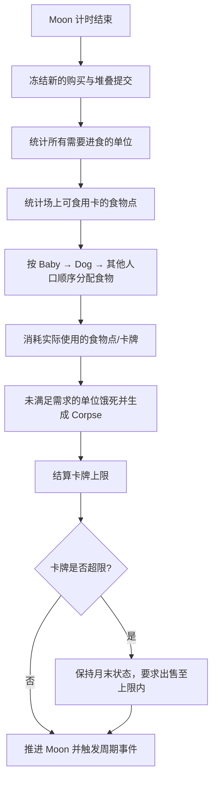
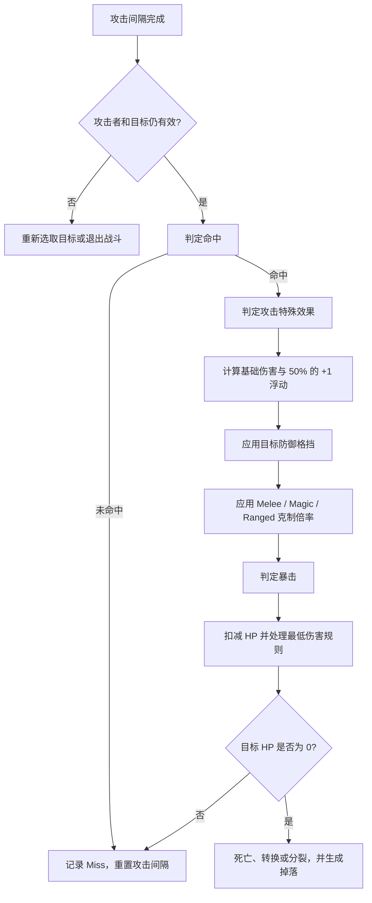

# Stacklands（堆叠大陆）Original 玩法与操作逻辑总结

> 文档定位：供 `Core/` 玩法系统设计与实现使用。  
> 资料范围：Original 主大陆闭环，121 张卡、10 种卡包、56 项基础任务。  
> 明细来源：[Stacklands-Original 卡牌配方与玩法逻辑](./Stacklands-Original卡牌配方与玩法逻辑.md)。  
> 不包含：美术、音频、动画、UI 布局，以及 The Island、Dark Forest、Cursed Worlds、Stacklands 2000 等扩展地图的完整玩法。

本文把卡牌明细重新整理为“玩家怎样操作、系统怎样判定、状态怎样变化”的实现规则。完整卡表、配方、卡包槽位和任务清单不在此重复维护，遇到数值冲突时以原始资料及最终选定的目标游戏版本为准。

## 1. 规则可信度

文中使用以下标记区分原作资料和实现补全项：

- **资料确认**：原始 Markdown 或其引用的 Wiki 页面明确给出。
- **实现默认值**：资料没有精确定义，但为了让游戏逻辑闭环而采用的确定行为；后续可由配置或实机结果替换。
- **待实机验证**：页面随版本调整、概率不完整，或 Original 清单与当前主大陆掉落池存在冲突。

点子卡只负责公开配方与收集进度。玩家即使尚未取得对应点子，只要提交的卡牌组合满足配方，仍应允许制作；点子本身不是配方原料。

## 2. 游戏目标与完整循环

玩家在一张持续运行的桌面上管理卡牌。卡牌既是资源，也是工人、食物、建筑、敌人、地点和事件。主要交互不是菜单指令，而是把卡牌拖到另一张卡或牌堆上，让系统识别其组合。

游戏同时维持三条压力线：

1. **食物**：每个 Moon 结束时人口必须消耗食物。
2. **空间**：超出卡牌上限时，玩家必须清理或出售多余卡牌。
3. **威胁**：中后期传送门、地点和部分卡包会生成敌人。

玩家的长期成长来自更稳定的生产设施、更多人口、更高的卡牌上限、更强的装备和已解锁卡包，而不是角色经验等级。

## 3. 玩家输入与卡牌操作

### 3.1 基础操作

| 玩家操作 | 前置条件 | 系统行为 | 完成结果 | 中断或失败条件 |
|---|---|---|---|---|
| 选择卡牌 | 卡牌可见且未被不可打断流程锁定 | 高亮卡牌并显示名称、描述、售价、食物或战斗信息 | 玩家获得操作目标 | 点击空白区域或改选其他卡牌 |
| 拖动卡牌 | 卡牌允许移动 | 卡牌跟随指针；原有合法工作通常被中断或重置 | 卡牌被移动或进入另一牌堆 | 释放位置无法堆叠时放到落点成新堆，重叠由统一解算顶开 |
| 堆叠卡牌 | 拖动卡与目标卡发生有效重叠 | 先按 4.1 判定是否允许堆叠；允许则合并为一个牌堆，并立即重新检查交互 | 合法组合开始计时；普通组合保持堆叠 | 不满足 4.1 条件或超出栈长上限时拒绝堆叠，被拖卡顶到目标旁边独立成堆；允许堆叠但凑不齐配方时不启动进度 |
| 拆开牌堆 | 从牌堆中拖出可移动卡 | 解除被拖卡与原堆关系并重新检查新旧两堆 | 工作可能中断，两个牌堆独立存在 | 被战斗或确认流程锁定时禁止拆分 |
| 打开卡包 | 已获得未开启卡包 | 按槽位依次生成卡牌，并应用点子、和平模式和条件过滤 | 卡包耗尽并销毁 | 槽位没有合法结果时进入后备规则，不得静默少发卡 |
| 购买卡包 | 卡包已解锁且 Coin 足够 | 消耗对应数量 Coin，生成一个待开启卡包 | 可立即开包 | Coin 不足或卡包未解锁 |
| 直接出售 | 卡牌可出售 | 把卡拖到出售区后，按基础售价转换为 Coin | 原卡销毁，生成 Coin | 唯一剧情物品、Coin 或不可出售卡拒绝进入 |
| Market 出售 | Market 空闲且目标卡可出售 | 保留 Market，锁定待售卡并计时 60 秒 | 待售卡销毁，获得基础售价两倍 Coin | 移走待售卡或 Market 时中断 |
| 装备 | 单位可装备且装备槽兼容 | 把 Equipment 放到单位上，写入装备并重算职业和战斗属性 | Villager 可变为 Explorer、Militia 或 Swordsman | 槽位不兼容或单位不能装备 |
| 卸下装备 | 单位持有可卸装备 | 移除装备并重算职业和属性 | 职业可恢复为 Villager | 战斗锁定期间按实现策略禁止或延后 |
| 发起战斗 | 友方单位与敌对单位接触 | 建立战斗组并开始自动攻击 | 一方全部失去战斗能力后结束 | 玩家主动发起的战斗允许撤出友方单位 |
| 暂停或切速 | 当前没有强制确认框阻挡 | 在暂停、1×、5×之间切换 | 所有受游戏时间控制的计时器同步变化 | 暂停时游戏时间不推进 |

### 3.2 输入层的实现边界

以下属于**实现默认值**：

- 指针释放后再提交堆叠，不在拖动途中的每一帧反复启动配方。
- 满足 4.1 条件但凑不齐配方的组合保持空间堆叠，不创建工作；不满足 4.1 条件的组合拒绝堆叠，被拖卡放到落点独立成堆，与目标的重叠由布局解算器统一顶开。
- 同一牌堆只运行一个主动交互，防止一组材料同时被两个配方消费。
- 被倒计时锁定的材料仍可被玩家拖走；拖走即取消该工作。战斗、召唤确认等特殊状态可单独禁止拖动。
- `Core/` 只接收“开始拖动、提交放置、打开、购买、出售、切速、确认”等语义命令；指针坐标、动画和音效属于表现层。

堆叠命中区域按被拖卡牌的碰撞体重叠判定（取重叠面积最大的候选卡），不按指针点命中。牌面重叠的顶开是**全局统一机制**：以牌堆和卡包为实体按牌面尺寸做 AABB 重叠检测，在游戏 Tick 末尾统一解算——拖放被拒、点开卡包生成新卡、月亮事件生成卡牌、读档残留等任何来源的重叠都会把较新（刚创建/刚移动）的一堆/一包顶开（静止目标不动，敌我交战接触豁免），表现上平滑滑开。以上属于**实现默认值**；拖动中间卡时是否携带其上方子堆、顶开的动画曲线细节属于**待实机验证**，不应固化为配方规则。

## 4. 堆叠、动作与配方判定

### 4.1 允许堆叠的判定条件

拖动卡与目标卡发生有效重叠后，系统先判定两张卡是否允许堆叠，再判定堆叠后触发什么交互。以下条件全部来自原作资料（**资料确认**），满足任意一条即允许堆叠：

| # | 条件 | 说明与示例 |
|---|------|-----------|
| 1 | 完全相同类型（同一 card Id） | 两张 Wood、两枚 Coin 可同类归并 |
| 2 | 双方都是村民类（Villager） | Villager、Explorer、Militia、Swordsman 等任何 Villager 子类互相可叠，战斗后合队即靠此规则；原作中 Dog、Baby 同为 Villager 子类 |
| 3 | 双方都是装备类（Equipable） | 任意武器 / 护甲互相可叠 |
| 4 | 存在配方 / 交互关系的异类组合 | 由规则表驱动，叠上后触发进度条：劳作（Villager + Berry Bush）、合成（3 Stone + Villager → Brick）、烹饪（Raw Meat + Campfire）、建造、驯化（Bone + Wolf → Dog）、事件（2 Corpse → Graveyard）、支付（5 Coin + Travelling Cart）。异类卡即使可叠，凑不齐配方也不会弹开，而是停着等待 |
| 5 | 栈长未满上限 | 原作一摞卡的上限为 30（mod 源码硬编码 `length < 30`，changelog 修过"pulling into stacks larger than 30"的 bug） |

不属于上述关系的组合在原作中不允许堆叠，两卡会被弹开。装备放到可佩戴单位上（Spear + Villager → Militia）属于条件 4 的交互关系；友方单位与敌对单位接触发起战斗，同样视为合法堆叠。

本项目的**实现默认值**：

- 判定按“被拖卡与落点命中的那张卡”成对执行；整堆拖动时要求每张被拖卡都与命中卡兼容。
- 村民类按卡牌 `category = VILLAGER` 判定（含 villager、explorer、militia、swordsman、dog、kid），与原作 Villager 继承体系一致。
- 配方 / 交互关系由 Luban 配置驱动：两卡可参与同一配方（各自匹配至少一项需求），或一方是动作来源卡、另一方匹配其原料或工人要求。
- 栈长上限走 `TbWorldRule.max_stack_size` 配置；当前项目配置为 20，与原作 30 不同，如需对齐原作改表即可。
- 敌对单位不可被玩家拖动（项目新增限制），但可以把友方单位拖到敌对单位上发起战斗。

### 4.2 统一判定流程

### 4.3 匹配原则

- 配方输入按集合匹配，卡牌在堆叠中的上下顺序通常不影响结果。
- 数量必须满足，例如 `2 Wood + 1 Stone + 1 Villager` 不能由一张 Wood 代替。
- 工人可按具体卡或标签匹配。Villager 及其职业变体是否可执行某项工作，应由工人要求决定，不能只靠颜色判断。
- 设施配方必须包含指定设施；设施通常保留，材料和食材通常消耗。
- 点子卡不作为输入，也不应遮挡对应配方。
- 同一卡牌只能被当前一个动作占用。周期生产、战斗和手动配方之间发生竞争时，已锁定的高优先级状态先执行。
- 允许额外卡牌的配方只消费明确匹配的数量；不允许额外卡牌的配方必须精确匹配其参与集合。

### 4.4 消耗角色

| 输入角色 | 默认完成行为 | 示例 |
|---|---|---|
| 材料、食材、货币 | 消耗 | Wood、Stone、Egg、Coin |
| 工人 | 保留并解除工作状态 | Villager 建造 House |
| 生产或烹饪设施 | 保留 | Smelter、Campfire、Stove |
| 种植基底 | 保留或按具体配方配置 | Soil、Garden、Farm |
| 装备 | 转移到单位装备槽 | Map、Spear、Sword |
| 被转换对象 | 销毁并生成新卡/新状态 | Wolf + Bone → Dog |
| 有限资源节点 | 每次减少使用次数，用尽后销毁 | Tree、Rock、Berry Bush |
| 无限生产建筑 | 保留并可重复工作 | Lumber Camp、Quarry、Iron Mine |

### 4.5 代表性配方链

- `Wood + Villager → Stick`，10 秒。
- `3 Wood + Villager → Plank`，30 秒；使用 Sawmill 时 `2 Wood → Plank`，10 秒。
- `3 Stone + Villager → Brick`，30 秒；使用 Brickyard 时 `2 Stone → Brick`，10 秒。
- `Smelter + Wood + Iron Ore → Iron Bar`，10 秒。
- `2 Wood + Stone + Villager → House`，30 秒。
- `5 Plank + 5 Brick + 3 Iron Bar + 3 Villager → Temple`，180 秒。

完整配方见[点子与配方明细](./Stacklands-Original卡牌配方与玩法逻辑.md#44-ideas点子32)。

## 5. 时间、Moon 与生存结算

### 5.1 时间域

- Moon 长度分为短 90 秒、普通 120 秒、长 200 秒。
- 正常速度为 1×，快速速度为 5×；暂停时游戏时间不推进。
- 配方、采集、生产、探索、攻击间隔、传送门和 Market 都使用游戏时间，因此统一受暂停和速度倍率影响。
- UI 动画、指针操作和不属于玩法的提示动画可继续使用非缩放时间。

### 5.2 月末顺序

资料确认的食物需求：

| 单位 | 每 Moon 食物点 | 喂食优先级 |
|---|---:|---:|
| Baby（婴儿） | 1 | 最高 |
| Dog（狗） | 1 | Baby 之后 |
| Villager 及成人职业 | 2 | Dog 之后 |

食物结算还应遵守：

- Egg、Potato、Raw Meat 的食物点为 0，不能直接用于月末喂食。
- 食物不足时，未被喂饱的单位死亡并转为 Corpse（尸体）。
- 具体先消费哪张同食物点卡、剩余食物点能否跨卡保留，原始资料未精确定义，属于**待实机验证**。实现默认按固定排序消费整张卡，保证同一种局面可重放。
- Frittata 或 Stew 被完整食用后可提供一 Moon 的 Well Fed，工作速度 `+100%`；效果时长与叠加方式由效果配置决定。

### 5.3 卡牌上限

- 基础上限由世界规则配置；Shed（棚屋）增加 4，Warehouse（仓库）增加 14。
- Coin（金币）不计入卡牌上限；其他豁免应由卡牌配置明确声明。
- 超限不会在生产结果生成时立即删除卡牌，而是在月末阻止继续，并要求玩家出售至上限以内。
- 用于计算上限的建筑若在月末被出售，必须立即重新计算允许数量。

## 6. 主要玩法系统

### 6.1 采集、生产与加工

- 有限节点：Tree、Rock、Berry Bush、Apple Tree、Iron Deposit。工人与节点堆叠后重复或单次采集，按节点掉落池生成结果；使用次数耗尽后节点销毁。
- 无限设施：Lumber Camp、Quarry、Iron Mine。必须有合法工人才能持续生产，建筑本身不耗尽。
- 自动加工设施：Brickyard、Sawmill、Smelter。匹配材料和设施后加工，设施保留。
- 动物周期产出：Chicken、Cow、Rabbit 每约 90 秒分别生产 Egg、Milk、Poop。动物存活且未被互斥状态锁定时推进周期。

掉落次数、权重或节点剩余使用次数没有可靠资料时必须标为**待实机验证**；运行时不得把空权重静默解释为 0 概率。

### 6.2 种植与料理

- 可种植食物放在 Poop、Soil、Garden 或 Farm 上进行复制或长成对应节点。
- Soil/Poop 最慢，Garden 较快，Farm 最快。例如 Apple 或 Berry 的确认时间为 120/90/60 秒。
- Campfire 是基础料理设施；Stove 使用相同配方，时间约为 Campfire 的 30%。
- 无需设施的组合料理可以直接计时，例如 `Apple + Berry → Fruit Salad`。
- 食材消耗，Campfire/Stove 保留，结果从牌堆弹出。

### 6.3 人口、成长和职业

- 两名成人与 House 堆叠，20 秒生成 Baby；两名成人和 House 保留。
- Baby 与 House 堆叠，240 秒成长为 Villager；Baby 被转换，House 保留。
- Wolf 与 Bone 组合后转为 Dog；两只 Dog 与 House 可繁殖 Dog。
- Villager 装备 Map 后成为 Explorer，装备 Spear 后成为 Militia，装备 Sword 后成为 Swordsman；卸下装备恢复基础职业。
- Explorer 探索约快一倍，其他工作慢 20%；Dog 的工作速度约为普通工人的一半。
- 职业应由基础单位和当前装备推导，不能作为与装备无关的永久卡种保存。

### 6.4 地点探索与宝箱

- Villager 放到紫色地点上通常探索 60 秒；Explorer 约快一倍。
- 每次完成后从该地点掉落池生成资源、敌人、宝箱或新地点。
- Catacombs 第 4 次探索固定获得 Golden Goblet，第 5 次探索后消失，且场上通常只允许一个。
- `Treasure Chest + Key` 打开宝箱：Key 和宝箱被消费，生成其战利品。
- `2 Corpse → Graveyard`，15 秒；Graveyard 本身也是可探索地点。

完整地点结果见[地点明细](./Stacklands-Original卡牌配方与玩法逻辑.md#47-locations地点6)。

### 6.5 金币、出售与商车

- 直接出售按基础售价结算；Market 经过 60 秒按双倍价格结算。
- 闪卡出现概率通常为 1%，可出售闪卡价值为普通卡的 5 倍。
- Travelling Cart 从 Moon 9 起，在奇数 Moon 有 10% 概率出现，Moon 19 保底。
- 每次向商车支付 5 Coin 获得一张随机卡；第 6 次购买固定获得 Golden Goblet。
- Coin 不可出售且不计卡牌上限；Coin Chest 只改变金币的桌面收纳，不改变货币总量。

### 6.6 卡包

卡包不是从一个总池中连续抽取。每个槽位独立选择点子池、普通池、和平模式替代池和固定结果。

抽取顺序如下：

1. 校验卡包解锁、购买或一次性发放条件。
2. 为每个槽位建立候选池。
3. 移除已经发现的 Idea/Rumor、违反持有条件的卡和当前模式禁止的卡。
4. 敌人槽在和平模式替换为指定和平池。
5. 若一次性点子仍有合法候选，按槽位规则抽取；否则使用普通池或后备池。
6. 按权重抽取结果，生成卡牌并记录首次发现。
7. 每张普通卡独立判定 1% 闪卡概率。
8. 所有槽位完成后销毁卡包，并检查 New Weaponry 一次性发放条件。

关键边界：

- 点子发现记录跨场面生效；已发现点子不能再次作为一次性点子掉落。
- 默认后备池为 Berry Bush、Rock、Tree，各约 33%。
- New Weaponry 在累计购买至少 10 个卡包后，首次完整开完任一卡包时自动获得，每局一次且不可购买。
- The Armory 和 Explorers 的敌人槽在当前卡包页面有 8 个各 12.5% 的结果，其中 3 个不属于 121 张 Original 卡。只保留 5 个 Original 敌人时不能未经说明归一化为各 20%；剩余概率如何处理属于**待实机验证**。
- 点子存在时的点子与常规池最终混合概率未被 Wiki 完整公开，必须通过配置标为推定值。

卡包价格、槽位和概率见[卡包明细](./Stacklands-Original卡牌配方与玩法逻辑.md#23-经济任务和卡包)。

### 6.7 任务与解锁

- 任务既是教学步骤，也是卡包解锁门槛。
- 任务完成记录跨局保留；相同任务只能首次完成时增加累计完成数。
- `Have` 类资源、食物、金币和建筑任务检查当前场面；Idea 数量检查累计发现数。
- 卡包按累计完成 3、10、16、22、24、26、30、34 项任务逐步解锁。
- A New World 是新存档一次性初始包；New Weaponry 使用购买次数触发，不使用任务数解锁。

完整 56 项任务见[基础版任务](./Stacklands-Original卡牌配方与玩法逻辑.md#5-基础版任务56-项)。

## 7. 战斗与周期威胁

### 7.1 战斗的进入和退出

- 友方单位与敌对生物接触后组成战斗组，所有参战者自动选择目标并按攻击间隔行动。
- 玩家主动把友方拖向敌人发起的战斗允许撤出单位，用于保护残血角色。
- 敌人主动触发时的撤退限制、战斗组最大距离和重新入场冷却属于**待实机验证**。
- 战斗结束后解除参战状态，存活单位保留当前生命值，死亡单位执行其死亡结果和掉落池。

### 7.2 单次攻击结算

资料确认的关系为 `Ranged > Melee > Magic > Ranged`，克制伤害提高 40%。基础伤害有 50% 概率 `+1`；防御按档位格挡，即使完全格挡仍有 50% 概率受到 1 点伤害。Combat Level 只是属性综合估值，不直接参与伤害计算。

特殊死亡必须由配置驱动，例如 Slime 死亡后生成 3 个 Small Slime。眩晕、Frenzy、Well Fed 等效果同样作为独立状态处理，不能硬编码到通用伤害公式。

### 7.3 传送门

- 从 Moon 12 开始，每 4 Moon 出现 Strange Portal。
- 每第 4 次应生成普通传送门时改为 Rare Portal，其威胁强度约为普通传送门两倍。
- 传送门出现 30 秒后生成敌群，敌群强度随 Moon 增长，在 Moon 46 后封顶。
- 和平模式不生成 Strange Portal 或 Rare Portal，并将卡包敌人槽替换为和平池。

## 8. 从开局到通关的实现流程

### 8.1 前期：建立生存闭环

1. 发放并打开 A New World：固定得到 Villager、Berry Bush、Rock、Wood、Coin。
2. 用 Villager 采集 Berry Bush、Rock 和 Tree，确保第一轮食物并完成基础教学任务。
3. 出售余卡获得 Coin，购买 Humble Beginnings 和 Seeking Wisdom。
4. 制作 Stick、Campfire、House；取得第二名 Villager 后繁育 Baby。
5. 建造 Shed，避免卡牌上限过早阻断发展。

### 8.2 中期：稳定人口与加工

1. 通过 Soil、Garden、Farm 建立食物复制链。
2. 使用动物和 Curious Cuisine 建立 Egg、Milk、Poop 与料理链。
3. 建造 Lumber Camp、Quarry，形成 Wood、Stone 的无限来源。
4. 制作 Plank、Brick，再建 Sawmill、Brickyard 提高加工效率。
5. 使用装备建立 Explorer 和战斗职业，应对地点敌人和传送门。

### 8.3 后期：工业、探索与战力

1. 从 Mountain、Order and Structure 或 Iron Mine 获得稳定 Iron Ore。
2. 建造 Smelter，使用 Wood + Iron Ore 制作 Iron Bar。
3. 建造 Warehouse 扩大上限，制作 Sword 等战斗装备。
4. 探索地点或等待 Travelling Cart，取得 Key、Treasure Chest、Catacombs 和 Golden Goblet。
5. 保持足够人口、食物和战力，应对周期传送门。

### 8.4 终局

1. 准备 `5 Plank + 5 Brick + 3 Iron Bar + 3 Villager`，180 秒建成 Temple。
2. 将 Golden Goblet 放到 Temple 并执行确认，消费或锁定金杯后召唤 Demon。
3. 击败 Demon，完成 `Kill the Demon` 任务并标记 Original 主线完成。

召唤确认是否暂停时间、Golden Goblet 在确认取消时如何恢复、通关后是否继续沙盒游戏，属于**待实机验证**；实现默认应允许取消确认且不消耗金杯，击败 Demon 后允许继续当前局。

## 9. 系统判定顺序与边界情况

| 场景 | 判定与处理原则 |
|---|---|
| 多个配方同时匹配 | 先比较显式优先级，再选需求更具体、匹配卡更精确的配方；仍相同则报告配置冲突，不随机选择 |
| 计时中移动参与卡 | 取消工作、释放全部锁定；材料不提前消耗 |
| 完成瞬间条件失效 | 完成前再次验证；失败则取消，不生成部分产出 |
| 同一卡被多个动作需要 | 已锁定动作优先，其他动作等待牌堆下一次变化后重新判定 |
| 结果位置拥挤 | 仍生成结果，由表现层在源牌堆附近寻找可见位置；不得吞掉产出 |
| 食物不足 | 按固定喂食优先级分配，未满足需求的单位转为 Corpse |
| 超出卡牌上限 | 月末进入强制清理状态，只允许出售、整理和查看，直到回到上限内 |
| 卡包条件过滤后为空 | 依次使用槽位后备池、卡包后备池；仍为空则抛出包含卡包和槽位 ID 的配置错误 |
| 掉落池含空权重 | 标记为不可抽取并报告配置问题，不能把空值当作 0 后继续运行 |
| 唯一卡已存在 | 按卡牌或动作配置阻止重复生成，改用后备结果；没有后备时报告明确错误 |
| 一次性奖励重复触发 | 先检查作用域内完成标记；已发放则忽略，不再次生成 |
| 任务条件重复满足 | 只更新当前状态，不重复增加完成数或重复发奖励 |
| 和平模式 | 禁止周期传送门，并在抽取敌人槽前替换为和平池 |
| 未验证数值被使用 | 使用已记录的实现默认值；若没有默认值则抛出包含规则 ID 和来源的明确错误 |
| 随机结果 | 所有随机选择通过同一可注入种子的随机源，权重过滤后再抽取，保证测试可重放 |

## 10. 配置驱动边界

玩法实现应从配置读取以下事实，不在通用系统中硬编码：

- 卡牌类别、标签、售价、食物点、上限占用、唯一性和可出售性。
- 工人食物需求、工作速度、探索速度和战斗属性。
- 配方输入、数量、消耗方式、持续时间、产出及额外卡允许策略。
- 节点/设施动作、周期时间、使用次数、掉落池和里程碑产出。
- 卡包槽位、点子池、普通池、和平池、条件、权重和后备池。
- Moon 长度、基础卡牌上限、喂食顺序、事件起始 Moon 和间隔。
- 任务条件、累计方式、持久化作用域和卡包解锁门槛。

通用系统只负责确定性的判定顺序、状态机和错误报告。UI 只发送语义命令和渲染只读状态，不直接修改卡牌、任务或战斗状态。

## 11. 原始资料索引

- [范围、版本与核心玩法](./Stacklands-Original卡牌配方与玩法逻辑.md#1-范围与版本说明)
- [卡包价格、槽位和掉落概率](./Stacklands-Original卡牌配方与玩法逻辑.md#23-经济任务和卡包)
- [121 张卡的颜色分类](./Stacklands-Original卡牌配方与玩法逻辑.md#3-按卡牌颜色分类121)
- [结构、单位、资源、点子、食物、生物、地点与装备](./Stacklands-Original卡牌配方与玩法逻辑.md#4-按玩法类型的详细卡牌资料)
- [56 项基础任务与解锁逻辑](./Stacklands-Original卡牌配方与玩法逻辑.md#5-基础版任务56-项)
- [资料来源与校验说明](./Stacklands-Original卡牌配方与玩法逻辑.md#6-资料来源与校验说明)

本总结不单独维护卡牌和概率数据。原始资料修订后，应复查本文中的代表性数值、判定流程和“待实机验证”项，避免摘要与配置产生版本漂移。
